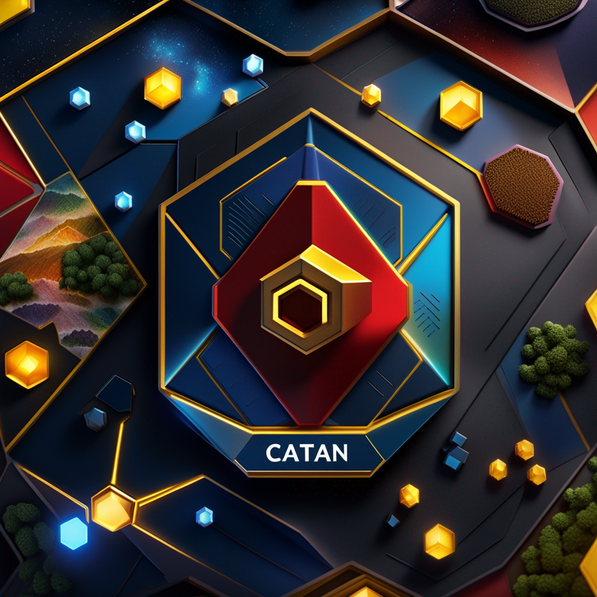
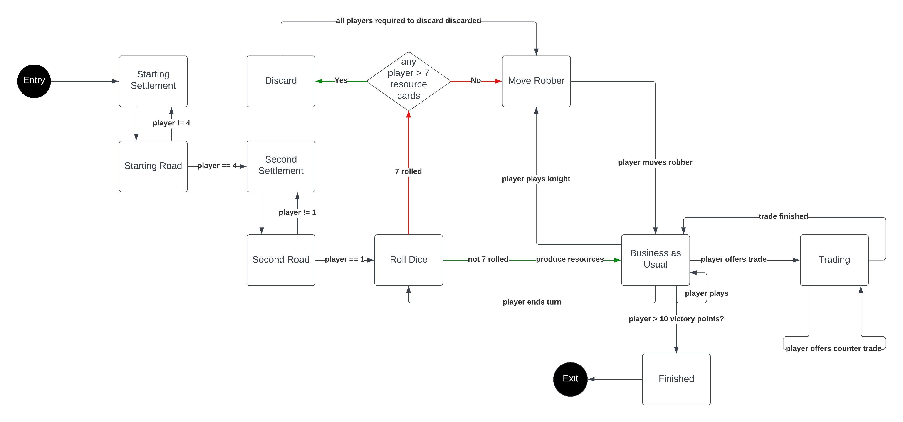

</img>
# Catan AI - ML of the Java Edition

A Multi-Agent PPO Reinforcement Learning Model, featuring Java 11 + PyTorch 2.0.1 with CUDA 11.7 (see `ai/`), built for the base-game of [Catan](https://www.catan.com/).
In addition, a React UI is provided in the `app/` folder for viewing previous games (other views are currently WIP), and the `database/` folder contains the information from a Docker container with PostgreSQL for storing all the GameStates.

The game environment was written in Java (originally, the plan was to write everything in Java, but the [DeepJavaLibrary](https://docs.djl.ai/) did not contain some modules I required). Therefore, I pivoted to using WebSockets with SpringBoot to communicate with a PyTorch AI, as the project was already set up as a SpringBoot REST API for the React game viewer.

## Table of Contents
- [Catan AI - ML of the Java Edition](#catan-ai---ml-of-the-java-edition)
  * [Table of Contents](#table-of-contents)
  * [Getting Started](#getting-started)
  * [Environment (aka Game Engine) Information](#environment--aka-game-engine--information)
    + [Java `src` Directory Structure](#java--src--directory-structure)
  * [Game Information & Explanation](#game-information---explanation)
    + [Catan Board](#catan-board)
      - [Nodes:](#nodes-)
      - [Edges:](#edges-)
      - [Tiles:](#tiles-)
    + [Players](#players)
    + [Game Loop](#game-loop)
    + [Actions and Action Executors](#actions-and-action-executors)
    + [Action State & Action State Machine](#action-state---action-state-machine)
    + [GameStates](#gamestates)
    + [Banks](#banks)
    + [A Note on WebSocket Communication](#a-note-on-websocket-communication)
      - [Message Structure](#message-structure)
      - ["Real-Time"](#-real-time-)
  * [Other Information](#other-information)

<small><i><a href='http://ecotrust-canada.github.io/markdown-toc/'>Table of contents generated with markdown-toc</a></i></small>

## Getting Started

*Note: Currently WIP.*

Clone this repository, and run:

`sudo ./start.sh`

## Environment (aka Game Engine) Information
The environment is written in Java, with modules including SpringBoot, Jackson, PostgreSQL, Lombok, and JUnit.
Qodana was used for static analysis, and a checkstyle modified from [Google's checkstyle](https://checkstyle.sourceforge.io/google_style.html) was used throughout the project.


Under the package `main.java.com.catanai.server`, you will find all the source code for the project.

### Java `src` Directory Structure
```
src
├── main.java.com.catanai.server
│     ├── config                     Websocket Configuration
│     ├── dao                        Database Access Object (for React Game Viewer)
│     ├── GameStateController.java   HttpController for getting GameStates.
│     ├── model                      Full game model.
│     │   ├── action
│     │   │   ├── ActionExecutor.java      Interface for all other ActionExecutors.
│     │   │   ├── Action.java              Enum for all possible actions in Catan.
│     │   │   ├── ActionMetadata.java      Contains metadata pertaining to Catan actions.
│     │   │   ├── ActionState.java         Determines which actions are valid at current state.
│     │   │   ├── ActionStateMachine.java  Transitions between action states.
│     │   │   ├── executors                Contains every single possible action executor.
│     │   │   └── TradeOffer.java          Contains trade offer information.
│     │   ├── bank
│     │   │   ├── Bank.java             Bank logic (resource, dev)
│     │   │   ├── card                  Information for cards (resource, dev)
│     │   │   ├── Dealer.java           Keeps track of all resource, dev banks.
│     │   │   ├── DevelopmentBank.java  Keeps track of all dev cards.
│     │   │   └── ResourceBank.java     Keeps track of all resource cards of certain type.
│     │   ├── board
│     │   │   ├── Board.java           Logic for placing on board, and tiles.
│     │   │   ├── building             All Catan buildings.
│     │   │   │   ├── Building.java    Abstract class for all other buildings.
│     │   │   │   ├── City.java        City logic.
│     │   │   │   ├── Road.java        Road logic.
│     │   │   │   └── Settlement.java  Settlement logic.
│     │   │   ├── graph
│     │   │   │   ├── Edge.java        Edges of Catan board (more info below)
│     │   │   │   ├── Node.java        Nodes of Catan board (more info below)
│     │   │   │   └── NodeMapper.java  Maps nodes to edges and tiles.
│     │   │   └── tile
│     │   │       ├── Port.java           Port square
│     │   │       ├── TerrainChit.java    Terrain value (2-12)
│     │   │       ├── Terrain.java        Terrain type (Desert, Wood, etc.)
│     │   │       ├── TileGenerator.java  Generates a random configuration of tiles for game.
│     │   │       └── Tile.java           All logic / info pertaining to Tile on board.
│     │   ├── Game.java           A Catan game, with logic for moving through game.
│     │   ├── gamestate
│     │   │   └── GameState.java  A snapshot of a Catan Game at a certain point as ints (aka observation)
│     │   └── player
│     │       ├── DeterministicPlayer.java  Player with predetermined moves
│     │       ├── PlayerID.java             Enum of all possible player IDs (1-4)
│     │       └── Player.java               Base abstract class, contains logic for all player actions.
└── test  All Unit Tests for Catan game.
```

## Game Information & Explanation
The rules for the game of Catan can be found on [the catan website](https://www.catan.com/sites/default/files/2021-06/catan_base_rules_2020_200707.pdf).

### Catan Board

The Catan board is a grid of hexagons. There are ways to reference a grid of hexagons through special coordinate systems (see [here](https://www.redblobgames.com/grids/hexagons/)). However, packing these coordinate systems into a 2D grid leads to some loss in space efficiency. In a push to make use of space as efficiently as possible, I instead labeled all nodes and edges with specific indexes (see below). These were then converted into the `node_edge_mapping.txt` and `node_tile_mapping.txt` seen in the top level directory, where:
- `node_edge_mapping.txt` maps each ***node*** to all connected ***edges***.
- `node_tile_mapping.txt` maps each ***tile*** to all connected ***nodes***.

In total, there are 54 nodes, 72 edges and 19 tiles on any given Catan board. This results in a fully-connected graph structure containing information about edges, nodes and tiles for each Catan game.

#### Nodes:


#### Edges:


#### Tiles:
Tiles are indexed from the top left to the bottom right tile of the board, left to right, row by row. <!-- TODO: Add tile indexes here -->

### Players
All players are Deterministic according to the Java environment. In this way, the moves each player attempts are stored in a local queue. Then, their moves are dequeued when the Catan environment asks the player to make a move on the environment. More information can be found below in [game loop](#game-loop). In addition, players are given 2 different `ResourceCard` maps: one pertaining to what cards others can view from their perspective, and one containing the full amounts of their resource cards. This mimics players counting cards in a Catan game to play optimally and know in general what cards a player may be seeking during a trade.

### Game Loop
The game loop can be summarized as:
- Get the current player.
- Dequeue their action.
- Attempt to perform that action.
- Return whether the action was successful or not.

The client (currently, only the AI) is responsible for sending a valid sequence of moves to the Catan game engine. In addition, the Python client logs all the `GameState`s to the database, since the majority of the logic for playing the Catan game is contained in the AI.

### Actions and Action Executors
The list of possible actions in a game of Catan are as follows (in no particular order):
- Playing buildings:
  - Play road
  - Play settlement
  - Play city
- Playing development cards:
  - Play knight
  - Play road building
  - Play year of plenty
  - Play monopoly
- Trade actions:
  - Offer trade
  - Accept trade
  - Decline trade
- 7 roll actions:
  - Move robber
  - Discard
- Normal gameplay actions:
  - End turn
  - Roll dice
- Misc.
  - Draw development card

Since each of these actions may need to be executed at a given timestep in the game, a map between the enum `Action` (containing all possible actions) and the `ActionExecutor` for each action was created. Following that, each action executor was populated with the logic pertaining to each action. Each `ActionExecutor` is given the `Player` who is attempting to execute the action, and the `ActionMetadata` pertaining to the action.

**Example**: In order to draw a development card, a `Player` must have an ore, wheat, and sheep resource in their hand, which are removed subsequently after drawing the card.

### Action State & Action State Machine
At a given timestep in a `Game`, the `Game` can inhibit something I refer to as an `ActionState`: a state which determines which set of `Action`s is possible. 

**Example**: At the start of the `Game`, players move in a clockwise, then counter-clockwise fashion placing 2 `Settlement` and `Road`. No other actions are allowed during this action state.

**Example**: When a 7 is rolled, players must discard if they have >7 cards, and then the player who rolled must move the robber. No other actions are allowed during this action state.

By modeling these actions as a [state machine](https://www.itemis.com/en/products/itemis-create/documentation/user-guide/overview_what_are_state_machines#:~:text=A%20state%20machine%20is%20a,state%20transitions%20and%20produces%20outputs.), we are able to easily know which states to transition to from any other state given `ActionMetadata`. See the state machine diagram below to see the general flow of the `ActionStateMachine`.



### GameStates
Required for a PPO AI is an observation of the state prior to doing an action, and an observation of the state after doing an action. The `GameState` class ensures all possible values in a game of Catan are given, such that the `Game` can be reconstructed at a later time (or passed as an observation to the PPO model). `GameState` is serialized into JSON values using the `toMap` method.

### Banks
There are 5 `ResourceCard` banks with 19 cards each and 1 `DevelopmentCard` bank with 25 cards in the game of Catan. These are handled by the `Dealer` class, and giving resources / taking resources from the banks all go through this `Dealer` class first, since there are some scenarios where no cards can be taken even if a number is rolled corresponding to a `TerrainChit`.

### A Note on WebSocket Communication
#### Message Structure
I haven't been able to find a library or agreed-upon set of standards for message structure using WebSockets. Because of this, I have defaulted to JSON, having the fields described below:

```
{
 'command': 'newGame' | 'getCurrentGameState' | 'makeMove' | 'addMove',
 'action'?: int[11], # Containing action + action metadata, only populated when command 'addMove' is present 
 'playerID'?: String # Only populated when 'addMove' is present
}
```

Each message is then deserialized by the `GameSocketHandler` and passed to the `SocketCommandHandler`. Therefore, if attempting to change entries in the message, both `GameSocketHandler` and `SocketCommandHandler` need to be updated manually as well to accommodate the new structure of the message. This seems unideal; I am open to feedback on how to improve this.

#### "Real-Time"
Although WebSockets allow for "real-time" communication, it must be true that having an integrated AI agent would reduce the overhead of sending/receiving to and from the server. This is originally why I chose the DeepJavaLibrary; however, while the library is useful to load and use AI agents, it seemed to have limited or overly complicated model training capabilities, at least with my limited research. In addition, many of the algorithms used for deep learning are easily found in Python. For this project, it didn't seem efficient to attempt to relearn how to train models; however, adding the capability to bring pre-trained AI models directly into Java would be an interesting feature to explore in the future.

## Other Information
To read more information about the UI, refer to the `README` in `app/`. *WIP*
For more information about the AI, refer to the `README` in `ai/`. *WIP*
For more information about the database, refer to the `README` in `database/`. *WIP*
I used VSCode to develop this project. It handled Java surprisingly well.
